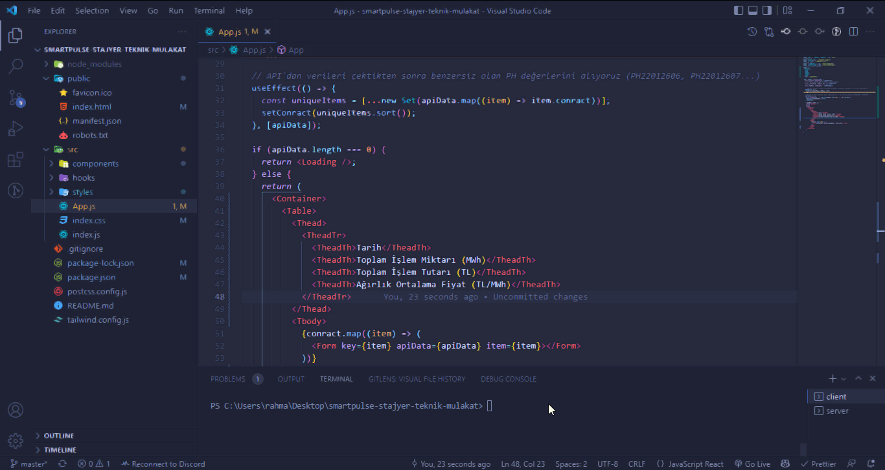

<h1 align="center">smartPulse Stajyer Teknik Mülakat Ödevi</h1>

## Canlı Önizlemesi (<a href='https://rahmancaylak-smartpulse-stajyer.netlify.app/'>Live</a>)

### Hangi Teknolojiler Kullanıldı

- React v18.0.0 (useState, useEffect, customHooks)
- Fetch API
- [Tailwind](https://tailwindcss.com/)
- [Tailwind Styled Components](https://www.npmjs.com/package/tailwind-styled-components)

## Local Kurulum

Cors hatası almamak için server kurulumunu yapmamız gerekiyor. Server Kurulumu için <a href='https://github.com/rahmancaylak/smartpulse-stajyer-mulakat-server'>tıklayınız</a>.

- Server kurulumunu yaptıktan sonra React uygulamamızın reposunu da bilgisayarımıza kuruyoruz.

  

- Server dosyasını ve React uygulamasını aynı klasörün içerisine atıyoruz.

  NOT: Atmak zorunda değilsiniz, sadece klasörlere rahat erişebilmek için gerekiyor.

- Yukarıdaki adımda oluşturduğumuz klasörü VSCode uygulamamız ile açıyoruz.

- VSCode ile iki tane terminal başlatıyoruz, bir tanesi server için diğeri de React uygulaması için.

- 1\. Terminalimize `ls` yazdıktan sonra iki tane klasör listelenecek. `cd smartpulse-stajyer-mulakat-server` ve `npm start` komutlarını sırasıyla yazıyoruz. Bu sayede server başlatılmış olacak.

- 2\. Terminalimize `ls`, `cd smartpulse-stajyer-teknik-mulakat`, `npm i` veya `npm install` yazarak gerekli node module klasörlerini yüklüyoruz. Son olarak `npm start` komutu ile de React uygulamamızı başlatıyoruz.
